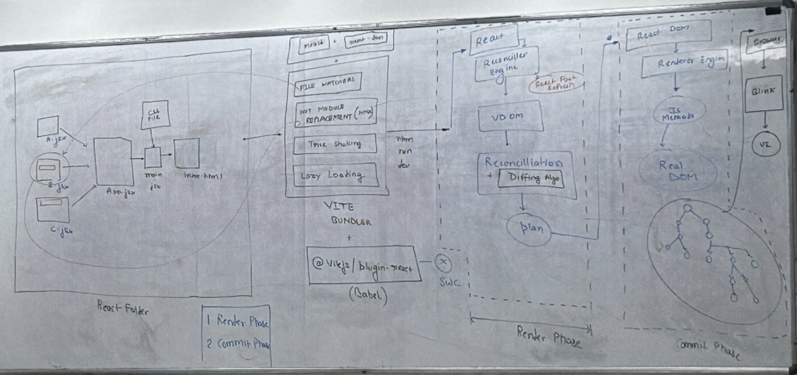

## 3. What is JSX? What are the rules to rite JSX?

- JSX stands for JavaScript XML.
- It is a syntax extension for JavaScript that allows you to write HTML-like code inside JavaScript files.
- It was introduced by Facebook (Meta) for React.

There rules are:-

1. Return Only One Parent Element
2. All Tags (including Self-Closing Tags) Must Be Properly Closed .
3. Use CamelCase for Attributes (ex:- onclick, onChange)
4. JavaScript Expressions in {}
5. To write comment in JSX use
   `{/* */}`
6. Don't use if-else directly inside JSX instead use ternary or logical operator.
7. Use className instead of class.
8. Use htmlFor instead of for in label tag.

## 4. What is a component in React? Types of component?

A component in React is a reusable(self-contained) piece of code that returns some piece of JSX.

It is of 2 types

1. Class Based component(CBC)
   - A Class Component is a JavaScript class that extends React.Component.
   - It has render() method to return JSX.
   - It was the traditional way of writing React components before 2019.

2. Function Based Component (FBC)
   - A function based component is a simple javascript function which returns some piece of jsx.
   - It is now the recommended and most popular way to write components in modern React.

## 5. What is React.Fragment and What is Empty Fragment?

1. Fragment:- A wrapper component that lets you group multiple elements without adding an extra DOM node to the HTML output.

2. Empty Fragment:- A shorthand syntax for React.Fragment that does the same thing — groups elements without extra DOM nodes — but doesn't support the key prop.

Note:- we can not write id and className attribute in both fragment.

## 6. What is Component Composition?

Component Composition is the practice of calling one component inside another component.

#### Example

```
function Header() {
  return <h1>Welcome</h1>;
}

function App() {
  return (
    <div>
      <Header />  {/* Header component called inside App */}
    </div>
  );
}
```

## 7. What is Props?

Props (short for "properties") are a mechanism used to pass data from one component to another, typically in a unidirectional (top-down) flow from parent to child.

#### Example

```
  // Parent passes props
  <Greeting name="Alice" age={25} />

  // Child receives and uses them
  function Greeting({ name, age }) {
    return <h1>Hello, {name}! You are {age} years old.</h1>;
  }
```

## 8. what is default props?

Default props in React allow you to define fallback values for a component's properties (props)

#### Example

```
function Greeting({ name = "Guest", age = 18 }) {
  return (
    <h1>Hello, {name}! You are {age} years old.</h1>
  );
}

<Greeting />
Component call Without passing props:
```

## 9. Why we use Props or characteristics of props?

##### Characteristics

- Immutable:- a child component cannot modify its own props
- Unidirectional:- data flows only from parent → child
- Any type:- strings, numbers, arrays, objects, functions, even JSX
- Destructured:- commonly destructured in the function signature for cleaner code

##### Usecase

- Pass Data:- Send data from parent component to child component
- Reusability:- Same component can be used multiple times with different data
- Dynamic Content:- Components show different content based on props received
- Avoid Repetition:- Write the component once, reuse it anywhere
- Communication:- The only way for a parent to talk to a child component

## 10. What is Children prop?

1.  children prop is a special, built-in property that allows you to pass content between the opening and closing tags of a component.
2.  Anything placed inside a component's tags is automatically passed to that component as props.children.
3.  Children can be strings, numbers, JSX elements, arrays, or even functions.

#### Example

```
 function Card({ children }) {
   return <div className="card">{children}</div>;
 }

 // Now you can put ANYTHING inside Card Component
 <Card>
   <h2>Title</h2>
   <p>Description here</p>
 </Card>
```

## 11. What is Props Drilling?

1. Prop Drilling is the process of passing data (props) through multiple layers of components to reach a deeply nested child that needs it, even if the intermediate components do not use that data

##### NOTE: To avoid props drilling we use context API, React State Management Libraries.

#### Example

```
    // ✅ Data starts here in Parent
    function Parent() {
      const name = "Alice";
      const age = 25;

      return (
        <div>
          <h1>I am Parent</h1>
          <Child name={name} age={age} />  {/* passing to Child */}
        </div>
      );
    }


    // ✅ Child receives and passes down to SubChild
    function Child({ name, age }) {
      return (
        <div>
          <h2>I am Child</h2>
          <SubChild name={name} age={age} />  {/* passing to SubChild */}
        </div>
      );
    }


    // ✅ SubChild finally uses the data
    function SubChild({ name, age }) {
      return (
        <div>
          <h3>I am SubChild</h3>
          <p>Name: {name}</p>
          <p>Age: {age}</p>
        </div>
      );
    }
```

## 12. What is render prop?

1.  Render Prop is when you pass a function as a prop to a component, and that component calls the function to render something.

#### Example

```
     // Component accepts a function as a prop
     function Greet({ render }) {
       return <div>{render("Alice")}</div>; // calls the function
     }

     // Passing a function as a prop
     <Greet render={(name) => <h1>Hello, {name}!</h1>} />

     // Output → Hello, Alice!
```

# 28/04/26

## 13. What is syntheticEvent Event in React ?

1- a syntheticEven in react is a cross-browser wrapper around the browser's native event object .
2- React normalization event so they behave identically across all broswer .
3- instead of getting a row MouseEvent of keyboardEvent from the dom, you get a syntheticEvent object that has the same interface (prevent Default(), stopPropagation(). target current Target etc.) but work consistently everywhere.

## 14. What is virual DOM ?

1 . The virtual Dom (VDOM) is a lightweigt , in memory kavascript representation (a tree of javaScript object ) of
the Real DOM . 2. Instead of uploading the real dom every somthing changes,React naintains the virtual copy of it in memory. 3. React uses it to creat a new tree on very re-render and then comapaer it with the previous one to optimize Dom updates.

## 15. What is Reconcillation ?

Reconcillation is the process React uses to figure out how to efficiently update the dom(Docunent object Model ) when changes occur in the Ui



## 16. What id Diffing Algorithm ?

Diffing Algorithm is React heuristic-based[0(n)] comparison algorithm that algorithm that efficiently finds differences between the new and old virtual DOM trees.

## 17. What is Render Phase?

The Render Phase is the first phase of React’s reconciliation process. During this phase, React invokes the component functions (or render() method in class components), creates a new Virtual DOM tree, and performs diffing to determine the minimal set of changes needed to update the UI.

It is pure and side-effect free.
React may pause, abort, or restart this phase multiple times (due to concurrent rendering in React 18+).
No DOM mutations or side effects should occur here.

## 18. What is Commit Phase?

The Commit Phase is the second and final phase of React’s reconciliation process. In this phase, React applies the calculated changes (mutations) to the real DOM in a single, synchronous batch.

It runs after the Render Phase is completed.
Side effects are executed here:
useLayoutEffect() (before browser paint)
useEffect() (after browser paint)

## 19. what is State?

State in React is an internal, mutable data structure that represents the dynamic data of a component.
whenever state variable changes react will re-render the component.

## 20. Difference between state and props?

props
Props are Immutable
Props are used for passing data from one component to another component.
Props are owned and controlled by the parent component.
The child component only receives and consumes them.
state
State is Mutable
State is internal to the component.
The component that declares it can directly read or update it.
State Update Triggers Re-render

## 21. What is Hooks?

Hooks are special built-in functions in React that allow you to use state and other React features (like lifecycle methods, context, refs, etc.) in functional components.
Features
Hooks introduced in React 16.8
Hooks allow Functional Components to be Stateful
Hooks Start with "use"
Enable Better Code Reuse

## 22. What is useState Hook?

"useState is a built-in React Hook that allows you to add and manage local state in functional components.
It returns an array with two elements: the current state value and a function to update that state."
syntax
const [state, setState] = useState(initialValue);
state → Current value of the state (read-only)
setState → Function used to update the state
initialValue → Initial value of the state (can be number, string, boolean, object, array, etc.)

## 23. What is Batching?

Batching in React is the process where React groups multiple state updates into a single re-render instead of re-rendering the component after every individual state update.
This improves performance by reducing unnecessary re-renders.

## 24. What is conditional Rendering ?

. Conditional Reandring in React is the technique of rendering of rendring different ui elements or components base on certain conditions.

.Here we use if-else , ternery operator and logical operator (short circuit operator).

## 25. can we write function as an initial value in useState(fn) Lazy Initialization?

"Lazy Initialization in useState is a technique where we pass a function as the initial value to useState. React calls this function only once during the initial render of the component and uses its return value as the initial state.
This is useful for expensive computations that should not run on every re-render."

syntax

const [state, setState] = useState(() => {
// This function runs ONLY ONCE during initial render
return expensiveComputation();
});
