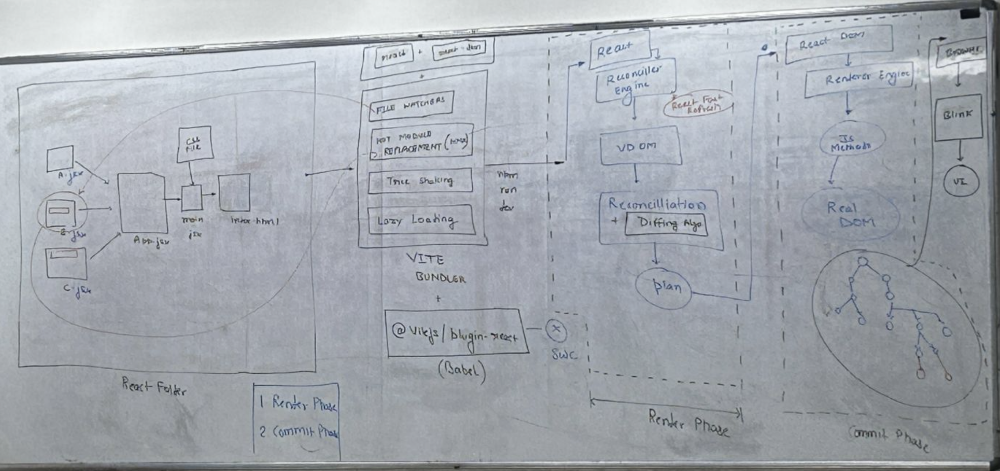

## 3. What is JSX? What are the rules to rite JSX?

- JSX stands for JavaScript XML.
- It is a syntax extension for JavaScript that allows you to write HTML-like code inside JavaScript files.
- It was introduced by Facebook (Meta) for React.

There rules are:-

1. Return Only One Parent Element
2. All Tags (including Self-Closing Tags) Must Be Properly Closed .
3. Use CamelCase for Attributes (ex:- onclick, onChange)
4. JavaScript Expressions in {}
5. To write comment in JSX use
   `{/* */}`
6. Don't use if-else directly inside JSX instead use ternary or logical operator.
7. Use className instead of class.
8. Use htmlFor instead of for in label tag.

## 4. What is a component in React? Types of component?

A component in React is a reusable(self-contained) piece of code that returns some piece of JSX.

It is of 2 types

1. Class Based component(CBC)
   - A Class Component is a JavaScript class that extends React.Component.
   - It has render() method to return JSX.
   - It was the traditional way of writing React components before 2019.

2. Function Based Component (FBC)
   - A function based component is a simple javascript function which returns some piece of jsx.
   - It is now the recommended and most popular way to write components in modern React.

## 5. What is React.Fragment and What is Empty Fragment?

1. Fragment:- A wrapper component that lets you group multiple elements without adding an extra DOM node to the HTML output.

2. Empty Fragment:- A shorthand syntax for React.Fragment that does the same thing — groups elements without extra DOM nodes — but doesn't support the key prop.

Note:- we can not write id and className attribute in both fragment.

## 6. What is Component Composition?

Component Composition is the practice of calling one component inside another component.

#### Example

```
function Header() {
  return <h1>Welcome</h1>;
}

function App() {
  return (
    <div>
      <Header />  {/* Header component called inside App */}
    </div>
  );
}
```

## 7. What is Props?

Props (short for "properties") are a mechanism used to pass data from one component to another, typically in a unidirectional (top-down) flow from parent to child.

#### Example

```
  // Parent passes props
  <Greeting name="Alice" age={25} />

  // Child receives and uses them
  function Greeting({ name, age }) {
    return <h1>Hello, {name}! You are {age} years old.</h1>;
  }
```

## 8. what is default props?

Default props in React allow you to define fallback values for a component's properties (props)

#### Example

```
function Greeting({ name = "Guest", age = 18 }) {
  return (
    <h1>Hello, {name}! You are {age} years old.</h1>
  );
}

<Greeting />
Component call Without passing props:
```

## 9. Why we use Props or characteristics of props?

##### Characteristics

- Immutable:- a child component cannot modify its own props
- Unidirectional:- data flows only from parent → child
- Any type:- strings, numbers, arrays, objects, functions, even JSX
- Destructured:- commonly destructured in the function signature for cleaner code

##### Usecase

- Pass Data:- Send data from parent component to child component
- Reusability:- Same component can be used multiple times with different data
- Dynamic Content:- Components show different content based on props received
- Avoid Repetition:- Write the component once, reuse it anywhere
- Communication:- The only way for a parent to talk to a child component

## 10. What is Children prop?

1.  children prop is a special, built-in property that allows you to pass content between the opening and closing tags of a component.
2.  Anything placed inside a component's tags is automatically passed to that component as props.children.
3.  Children can be strings, numbers, JSX elements, arrays, or even functions.

#### Example

```
 function Card({ children }) {
   return <div className="card">{children}</div>;
 }

 // Now you can put ANYTHING inside Card Component
 <Card>
   <h2>Title</h2>
   <p>Description here</p>
 </Card>
```

## 11. What is Props Drilling?

1. Prop Drilling is the process of passing data (props) through multiple layers of components to reach a deeply nested child that needs it, even if the intermediate components do not use that data

##### NOTE: To avoid props drilling we use context API, React State Management Libraries.

#### Example

```
    // ✅ Data starts here in Parent
    function Parent() {
      const name = "Alice";
      const age = 25;

      return (
        <div>
          <h1>I am Parent</h1>
          <Child name={name} age={age} />  {/* passing to Child */}
        </div>
      );
    }


    // ✅ Child receives and passes down to SubChild
    function Child({ name, age }) {
      return (
        <div>
          <h2>I am Child</h2>
          <SubChild name={name} age={age} />  {/* passing to SubChild */}
        </div>
      );
    }


    // ✅ SubChild finally uses the data
    function SubChild({ name, age }) {
      return (
        <div>
          <h3>I am SubChild</h3>
          <p>Name: {name}</p>
          <p>Age: {age}</p>
        </div>
      );
    }
```

## 12. What is render prop?

1.  Render Prop is when you pass a function as a prop to a component, and that component calls the function to render something.

#### Example

```
     // Component accepts a function as a prop
     function Greet({ render }) {
       return <div>{render("Alice")}</div>; // calls the function
     }

     // Passing a function as a prop
     <Greet render={(name) => <h1>Hello, {name}!</h1>} />

     // Output → Hello, Alice!
```

# 28/04/26
## For Test -2 
## 13. What is syntheticEvent Event in React ?

1- a syntheticEvent in react is a cross-browser wrapper around the browser's native event object .
2- React normalization event so they behave identically across all broswer .
3- instead of getting a row MouseEvent of keyboardEvent from the dom, you get a syntheticEvent object that has the same interface (prevent Default(), stopPropagation(). target current Target etc.) but work consistently everywhere.

## 14. What is virual DOM ?

1 . The virtual Dom (VDOM) is a lightweigt , in memory kavascript representation (a tree of javaScript object ) of
the Real DOM . 2. Instead of uploading the real dom every somthing changes,React naintains the virtual copy of it in memory. 3. React uses it to creat a new tree on very re-render and then comapaer it with the previous one to optimize Dom updates.

## 15. What is Reconcillation ?

Reconcillation is the process React uses to figure out how to efficiently update the dom(Docunent object Model ) when changes occur in the Ui



## 16. What id Diffing Algorithm ?

Diffing Algorithm is React heuristic-based[0(n)] comparison algorithm that algorithm that efficiently finds differences between the new and old virtual DOM trees.

## 17. What is Render Phase?

The Render Phase is the first phase of React’s reconciliation process. During this phase, React invokes the component functions (or render() method in class components), creates a new Virtual DOM tree, and performs diffing to determine the minimal set of changes needed to update the UI.

It is pure and side-effect free.
React may pause, abort, or restart this phase multiple times (due to concurrent rendering in React 18+).
No DOM mutations or side effects should occur here.

## 18. What is Commit Phase?

The Commit Phase is the second and final phase of React’s reconciliation process. In this phase, React applies the calculated changes (mutations) to the real DOM in a single, synchronous batch.

It runs after the Render Phase is completed.
Side effects are executed here:
useLayoutEffect() (before browser paint)
useEffect() (after browser paint)

## 19. what is State?

State in React is an internal, mutable data structure that represents the dynamic data of a component.
whenever state variable changes react will re-render the component.

## 20. Difference between state and props?

props
Props are Immutable
Props are used for passing data from one component to another component.
Props are owned and controlled by the parent component.
The child component only receives and consumes them.
state
State is Mutable
State is internal to the component.
The component that declares it can directly read or update it.
State Update Triggers Re-render

## 21. What is Hooks?

Hooks are special built-in functions in React that allow you to use state and other React features (like lifecycle methods, context, refs, etc.) in functional components.
Features
Hooks introduced in React 16.8
Hooks allow Functional Components to be Stateful
Hooks Start with "use"
Enable Better Code Reuse

## 22. What is useState Hook?

"useState is a built-in React Hook that allows you to add and manage local state in functional components.
It returns an array with two elements: the current state value and a function to update that state."
syntax
const [state, setState] = useState(initialValue);
state → Current value of the state (read-only)
setState → Function used to update the state
initialValue → Initial value of the state (can be number, string, boolean, object, array, etc.)

## 23. What is Batching?

Batching in React is the process where React groups multiple state updates into a single re-render instead of re-rendering the component after every individual state update.
This improves performance by reducing unnecessary re-renders.

## 24. What is conditional Rendering ?

. Conditional Reandring in React is the technique of rendering of rendring different ui elements or components base on certain conditions.

.Here we use if-else , ternery operator and logical operator (short circuit operator).

## 25. can we write function as an initial value in useState(fn) Lazy Initialization?

"Lazy Initialization in useState is a technique where we pass a function as the initial value to useState. React calls this function only once during the initial render of the component and uses its return value as the initial state.
This is useful for expensive computations that should not run on every re-render."

syntax

const [state, setState] = useState(() => {
// This function runs ONLY ONCE during initial render
return expensiveComputation();
});


## 26. what is useEffect?
The useEffect hook is a built-in React function that allows you to perform side effects in functional components.

Side effects are operations that interact with systems outside of React's (like api call).

1. No dependency array - runs after every render
syntax
useEffect(() => {
  console.log("runs after every render");
});
2. Empty dependency array - runs once on mount
syntax
useEffect(() => {
  console.log("runs once, like componentDidMount");
}, []);
3. With dependencies - runs when those values change
syntax
useEffect(() => {
  console.log("runs when count or name changes");
}, [count, name]);
## 27. difference between useState and useEffect Hook?
useState:
Used to add and manage state (data) in functional components.
Returns an array with 2 values: [currentState, setState].
Updating state with setState() triggers a re-render of the component.
Preserves value between re-renders.
useEffect:
Used to perform side effects (actions outside normal rendering).
Runs after the component renders (and after paint in most cases).
Common uses: data fetching, DOM manipulation, subscriptions, timers, event listeners.
The useEffect hook itself does not return any value (it returns undefined).
## 28. what is React lifecycle methods in Function Based Component?
Every React component goes through 3 phases in its life:

  MOUNT  →  UPDATE  →  UNMOUNT
  (born)    (changes)   (dies)

 ## Phase 1: MOUNTING
- Component is created and inserted into the DOM for the first time.
- On Mounting phase useEffect Runs only once after component is added to DOM.

```
  useEffect(() => {
    console.log("runs once, like componentDidMount");
  }, []);
```
## Phase 2: Updating
Component re-renders due to state or prop changes.
On Updating Phase useEffect runs when a specific value changes.
  useEffect(() => {
    console.log("runs when count or name changes");
  }, [count, name]);
## Phase 3: Unmounting
Component is removed from the DOM.
useEffect cleanup function will be called in this phase
useEffect(() => {
console.log("runs when count or name changes");


return () => {
      console.log("Cleanup function);  // This cleanup function will be called
}
}, []);


## 29. what is Single Page Application?
A Single Page Application is a web app that loads a single HTML document and dynamically updates the DOM using JavaScript instead of requesting new pages from the server on each navigation.

## 30. what is Multi Page Application?
A Multi-Page Application (MPA) is a traditional web architecture where every user interaction—like clicking a link or submitting a form—triggers a full browser refresh to load a completely new HTML page from the server.

## 31. Difference between SPA and MPA?
Aspect: SPA MPA Page Loads: One initial load Full reload per page Performance: Faster navigation Slower navigation SEO: Harder (needs SSR) Naturally good Development: Usually one codebase Traditional (multiple pages) Initial Load: Slightly high Low

## 32. what is client side routing?
Client-side routing is when the navigation between pages is handled by JavaScript in the browser. Instead of requesting a new page from the server, the JavaScript libraries (like React Router, Vue Router) updates the URL using the History API and renders the appropriate component/view without reloading the page.

## 33. what is Server side routing?
Server-side routing is the traditional method where the browser sends a request to the server for every new URL; the server then generates and sends back a complete HTML page, causing a full browser refresh.

## 34. what is react-router-dom ?
React Router DOM is a popular library for client-side routing in React applications. It allows you to create a Single Page Application (SPA) and navigate between them without full page reloads.

## 35. what is createBrowserRouter and BrowserRouter?
createBrowserRouter:
A function introduced in React Router v6.4+ that creates a router instance using the History API. It is the recommended way to define routes as it supports data APIs like loaders, actions, and fetchers.

BrowserRouter:
A component that wraps your app and enables client-side routing using the History API. It does not support React Router v6.4+ data APIs like loaders and actions.

## 36. Difference between Link and NavLink?
Link
A component that renders an anchor tag and navigates(move) to a route without a full page reload.
Used in for general navigation (e.g., a "Read More" button or a link in a footer).
Navlink
Same as Link but applies an active class when its route matches the current URL.
Used in Navbar or Dashboard tabs.
## 37. what is an Outlet?
A component used in parent routes that acts as a placeholder where the matched child route's component gets rendered.

Syntax
function Dashboard() {
  return (
    <div>
      <h1>Dashboard</h1>
      <Outlet /> {/* child route renders here */}
    </div>
  );
}
## 38. what is index prop?
A boolean prop on a route that marks it as the default child route, rendered inside the parent's Outlet when no other child route matches.

Syntax
const router = createBrowserRouter([
  {
    path: "/dashboard",
    element: <Dashboard />,
    children: [
      { index: true, element: <DashboardHome /> }, // renders when path is exactly /dashboard
      { path: "settings", element: <Settings /> },
    ],
  },
]);


# Test -3 

# 39. What is useNavigate Hook?

useNavigate is a hook that returns a navigate function used to navigate to different routes in your app.
It replaces the old useHistory hook and allows navigation with options like replace, state, or delta
Example
    navigate('/dashboard', { replace: true })).

# 40. How to create 404 not Found page?

A 404 Not Found page is an error page that appears when a user tries to access a URL/route that doesn't exist on your website or application.

const router = createBrowserRouter([
  // Explicit 404 route
  {
    path: "*",
    element: <NotFound />,
  },
]);

# 41. What is Dynamic Routing?

Dynamic Routing is a technique where routes are defined with dynamic segments (parameters) so that a single route can handle multiple URLs.
Example
      const router = createBrowserRouter([
        { path: "/", element: <Home /> },
        { path: "/notes/:id", element: <NoteDetail /> },   // Dynamic Route
        { path: "*", element: <NotFound /> }
      ]);

# 42. What is useParams Hook?

useParams is a React Router hook that lets you access dynamic values from the URL.
If your route is /notes/:id, then useParams() gives you the id value.
Syntax
  const { id } = useParams();

# 43. What is Navigate Component? Difference between Navigate vs useNavigate?

Navigate is a React Router component used to redirect users to another route declaratively when it is rendered.

Navigate Componentuse
It is a React component used for declarative redirection.
It is mainly used for automatic redirects
useNavigate Hook
It is a React hook that returns a function to navigate programmatically.
It is used inside event handlers like button clicks, form submissions, or after async operations.
# 44. What is useSearchParams Hook?

useSearchParams is a React Router hook used to read and update the query parameters (search params) in the URL.
It returns an array with the current search params object and a function to update.
Example
import { useSearchParams } from 'react-router-dom';

function Component() {
  const [searchParams, setSearchParams] = useSearchParams();

  // Read
  const page = searchParams.get('page');
  const filter = searchParams.get('filter');

  // Update
  const handleFilter = () => {
    setSearchParams({ filter: 'active', page: 1 });
  };

  return <div>...</div>;
}

# 45. Difference between useParams and useSearchParams?

useParams Hook:
It is used to access dynamic route parameters defined in the URL path.
Works with routes like /users/:id or /notes/:noteId.
Returns a simple object (e.g., { id: "45" }).
Mainly used for unique page identification.
useSearchParams Hook:
It is used to read and modify query parameters (search params) in the URL.
Works with URLs like /notes?search=react&page=2.
Returns an array [searchParams, setSearchParams].
Mainly used for filtering, searching, sorting, and pagination.

# 46. What is useRouteError Hook?

useRouteError is a React Router hook that returns the error thrown while rendering, loading, or navigating to a route.
It is used only inside an errorElement to display error messages to the user.
syntax
import { useRouteError } from 'react-router-dom';

function ErrorPage() {
  const error = useRouteError();

  return (
    <div>
      <h1>Oops! Something went wrong</h1>
      <p>{error.status} - {error.statusText}</p>
      <p>{error.data || error.message}</p>
    </div>
  );
}

# 47. What is useLoaderData Hook?

useLoaderData is a React Router hook that allows you to access the data returned by the loader function of the current route.
It is used for data fetching before a component renders (great for SEO and performance).
syntax
import { useLoaderData } from 'react-router-dom';

function NoteDetail() {
  const note = useLoaderData();     // Get data from loader

  return (
    <div>
      <h1>{note.title}</h1>
      <p>{note.body}</p>
    </div>
  );
}

# 48. What is useOutletContext Hook?

useOutletContext is a React Router hook that allows nested child routes to access data/context passed from their parent route.
It helps in sharing data between parent and child components without using prop drilling.
syntax
 // Child Component
import { useOutletContext } from 'react-router-dom';

function ChildPage() {
  const context = useOutletContext();   // Get data from parent

  return <h1>{context.userName}</h1>;
}

// Parent Route
function Layout() {
  const user = { userName: "Chombu", role: "admin" };

  return <Outlet context={user} />;   // Passing data
}
# 49. What is Public Route?

A Public Route is a route that can be accessed by anyone, whether the user is logged in or not.

# 50. What is Protected Route?

A Protected Route is a route that can only be accessed by authenticated users (logged-in users).

# 51. What is CORS?

CORS stands for Cross-Origin Resource Sharing.
It is a security mechanism implemented by web browsers that allows or restricts web pages from making requests to a different domain
Without proper CORS policy on the backend, the browser will block the request and show an error.
# 52. What is CORS Policy?

CORS Policy is a set of rules defined by the server that tells the browser whether it should allow or block a cross-origin request. -It is sent by the server in the form of special HTTP headers (like Access-Control-Allow-Origin).
# 53. Why Does CORS Exist?

Browsers follow the Same-Origin Policy (security feature) by default, which blocks requests from one domain to another to prevent malicious websites from accessing sensitive data.
CORS is the controlled way to relax that restriction.
# 54. How to fix CORS?

Step-1: Install cors package
 npm install cors
Step-2: Use cors in backend
import cors from "cors";

app.use(cors({
  origin: ['http://localhost:3000', 'http://localhost:5173'],   // your frontend URLs
  credentials: true,                                            // if using cookies/auth
  methods: ['GET', 'POST', 'PUT', 'DELETE', 'OPTIONS'],         // Allowed Methods
  allowedHeaders: ['Content-Type', 'Authorization']             // Allowed headers
}));

# 55. What is useActionData Hook?

useActionData is a React Router hook that returns the data returned by the most recently executed action function of the current route.

// Action function (returns data instead of redirecting)
export const handleSignup = async ({ request }) => {
    const form = await request.formData();
    const user = {
        email: form.get("email"),
        password: form.get("password")
    };

    const response = await fetch("http://localhost:3000/api/auth/register", {
        method: "POST",
        headers: { "Content-Type": "application/json" },
        body: JSON.stringify(user)
    });

    if (!response.ok) {
        const err = await response.json();
        return { error: err.message }; // returned, not thrown
    }

    return redirect("/dashboard");
};
// Component consuming action data
import { useActionData } from "react-router-dom";

const Signup = () => {
    const data = useActionData();

    return (
        <Form method="post">
            <input name="email" type="email" />
            <input name="password" type="password" />
            {data?.error && <p>{data.error}</p>}
            <button type="submit">Register</button>
        </Form>
    );
};
# 56. Difference between useState and useRef ?

1. Purpose:

useState: Used to manage state that affects the UI (reactive state).
useRef: Used to store mutable values that persist across renders.

2. Re-rendering:

useState: Updating state causes the component to re-render.
useRef: Updating ref.current does not cause re-render.

3. Syntax:
useState: const [value, setValue] = useState(initialValue)
useRef: const ref = useRef(initialValue)

4. Access & Update:
useState: Update using setValue(newValue)
useRef: Update directly ref.current = newValue

5. Use Cases:
useState: Form inputs, counters, toggles, fetched data, UI-dependent values.
useRef: DOM references (focus, scroll), previous value tracking, timers, mutable flags.

5. Performance:
useState: Can be expensive due to re-renders on every update.
useRef: Lightweight, no re-renders.

6. When to Use:
Use useState when you want the UI to update when value changes.
Use useRef when you just need to "remember" a value without UI update.
# 57. Difference between Controlled Form and Uncontrolled Form?

Controlled: React controls the form using state + value + onChange. Controlled needs more code but gives better control & validation.

Uncontrolled: DOM controls the form (using defaultValue or ref). Uncontrolled is simpler and faster but harder to validate.

